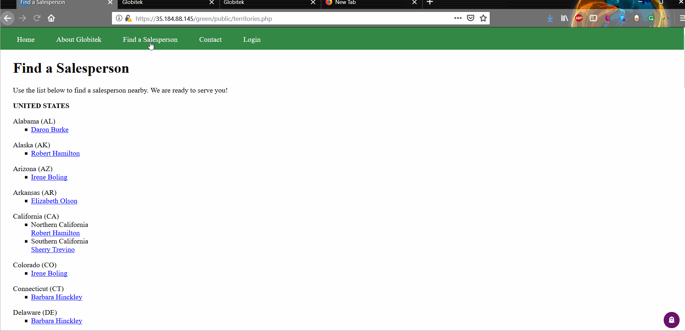
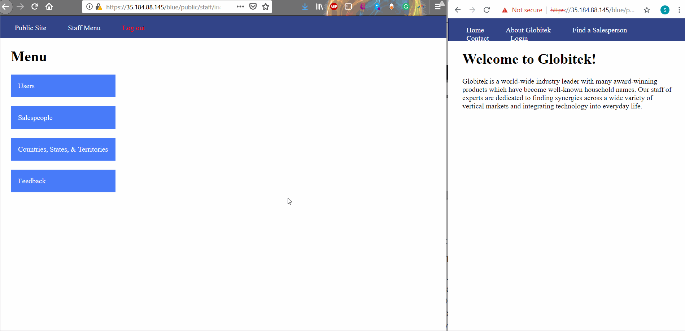
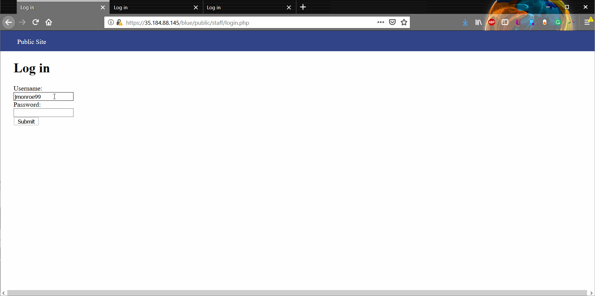
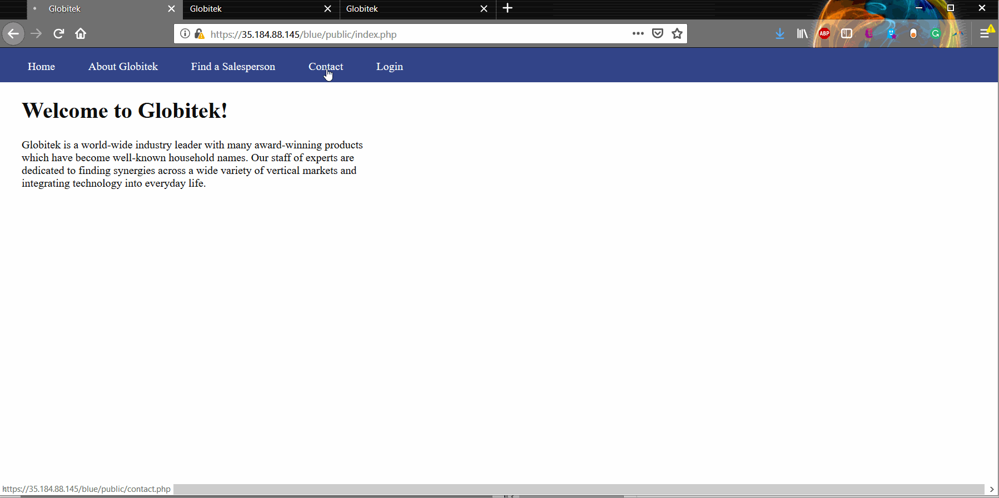
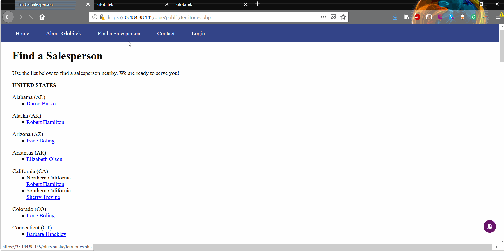

# Project 8 - Pentesting Live Targets

Time spent: **8** hours spent in total

> Objective: Identify vulnerabilities in three different versions of the Globitek website: blue, green, and red.

The six possible exploits are:
* Username Enumeration
* Insecure Direct Object Reference (IDOR)
* SQL Injection (SQLi)
* Cross-Site Scripting (XSS)
* Cross-Site Request Forgery (CSRF)
* Session Hijacking/Fixation

Each version of the site has been given two of the six vulnerabilities. (In other words, all six of the exploits should be assignable to one of the sites.)

## Blue

Vulnerability #1: SQL Injection

Most of the data input received by these websites is being sanitized properly. However, one of the three sites has one place where the input is not being sanitized before being used in an SQL query. Determine which color has the vulnerability.

- Instructions:
  1) We see in the url that we can insert an SQL statement at the end to try to change our result
  2) After some tests we eventually see the new command work
  3) Going through each site we can see only the blue will load the salesperson after our altered command 
  
- Code:  

- One test example: 

Vulnerability #2: Session Hijacking/Fixation

Two of the three websites expire their active sessions and require users to re-login every 30 minutes. That is probably too aggressive for the real world, but it is better than the third site which allows sessions to be a year old, and never regenerates the session ID, even when the user agent string changes. This makes it vulnerable to both session hijacking and session fixation attacks.

- Instructions:
  1) Obtained the PHPSESSIONID from using the HackerTools from one login and one type of browser.
  2) Repeated step 1 but in a different browser, however I copied the original PHPSESSIONID into this new browser
  3) From multiple tests, this only worked with the blue site.

## Green

Vulnerability #1: Username Enumeration

A careless developer mistake has created a username enumeration vulnerability. Determine which color has the vulnerability. You can use the existing username "jmonroe99" as a test. Next, figure out what mistake the developer made.

- Instructions:
  1) Using the username "jmonroe99" and a random password, attempt to log in for each of the colored sites.
  2) Notice for the green site, with some small username alteration, the "Log in Was Unsuccessful" does not change to bold.
  
Vulnerability #2: Cross-Site Scripting

All three sites do a good job of protecting against a reflected XSS attack. However, one of the sites has a mistake which leaves the site vulnerable to a stored XSS attack. A reflected XSS attack would be easy to reveal, while a stored XSS does not provide instant feedback. You will need to log into the admin area and look through the CMS in order to "spring the trap" and find out if your attack succeeded. Determine which color has the vulnerability. Remember, others will be attacking these sites alongside you. Use your name in the XSS so that your results won't be confused with anyone else's (example: ).

- Instructions:
  1) Using the code provided, we fill out the "Contact Us" in order to later check out our feedback.
  2) From checking out the "Feedback" section, we see the attack only on the green site.
  
- Code:  
  
## Red

Vulnerability #1: Cross-Site Request Forgery

One of the three sites does not have CSRF protections on the admin area. A clever attacker could design a form which would automatically submit form data to the staff area and take advantage of a logged in user's access permissions. Be the attacker and design a form which will make a change to the spelling of some database content. (For example, change the first user from "James" to "Jim", or change "Alabama" to "Alabamaaaa".) Then point the form action at each of the three sites to find out which color has the vulnerability. Do not neglect to be stealthy with your form—your unsuspecting, logged-in admin should neither see the form nor the results of the form submission.

- Instructions:
  1)For each colored site, under Salespeople list, we will edit a users CSRF Tocken.
  2)Next we edit a value in the form, email was showed.
  3)Each site, after submitting the edit would show us an error except for the red website that actually showed the edit.
  
 
Vulnerability #2: Insecure Direct Object Reference
  
One of the three sites is missing code which would prevent some sensitive information from being made public. Determine which color has the vulnerability. Then, figure out what the other two sites did correctly to prevent the information leak.

- Instructions:
  1)For each colored site click on "Find a Salesperson" and click on any person.
  2)At the end of the page URL you will typically see "id=X" where X is a numeric. 
  3)Change this X value until you find a person who should not exist in the list. The red site appears to show this person.
 
- Code: "id=10" 
  
## Notes

No challenges encountered
  
